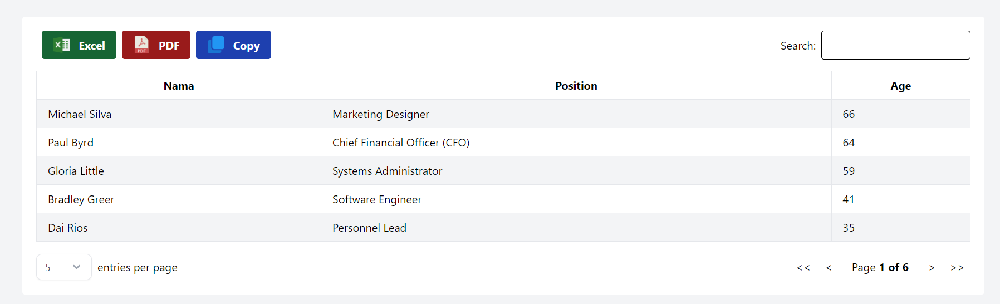

# NextJS Table Example



Proyek ini merupakan contoh penggunaan table pada NextJS yang dilengkapi dengan berbagai fitur untuk meningkatkan interaktivitas dan kemudahan penggunaan. Proyek ini sangat cocok untuk Anda yang ingin mempelajari implementasi table lengkap dalam aplikasi NextJS.

## Fitur

Proyek ini mencakup fitur-fitur berikut:

- **Search**: Memudahkan pengguna untuk mencari data spesifik dalam tabel.
- **Export**: Mendukung ekspor data tabel ke format Excel dan PDF.
- **Copy**: Memungkinkan pengguna untuk menyalin data tabel.
- **Sorting**: Fitur pengurutan data berdasarkan kolom tertentu.
- **Pagination**: Untuk navigasi antar halaman data dengan mudah.
- **Limit View per Page**: Mengatur jumlah data yang ditampilkan per halaman.
- **Responsive Design**: Tampilan tabel yang responsif untuk berbagai ukuran layar.

## Cara Penggunaan

Untuk menggunakan proyek ini, ikuti langkah-langkah berikut:

1. **Clone Repository**

   ```bash
   git clone https://github.com/afifudinmtop/nextjs_table.git
   ```

2. **Masuk Ke Folder**
   Masuk ke direktori proyek yang telah di-clone

   ```bash
   cd ./nextjs_table/my-app/
   ```

3. **Instalasi Dependensi**
   Jalankan perintah berikut untuk menginstal semua dependensi yang diperlukan:

   ```bash
   npm install
   ```

4. **Build Aplikasi**
   Build aplikasi untuk produksi dengan perintah:

   ```bash
   npm run build
   ```

5. **Menjalankan Aplikasi**
   Setelah build selesai, jalankan aplikasi dengan:

   ```bash
   npm start
   ```

6. **Akses Aplikasi**
   Buka browser dan akses http://localhost:3000 untuk melihat aplikasi berjalan. Anda akan melihat tabel yang sudah dilengkapi dengan data dummy yang siap untuk diinteraksi.

## Kontribusi

Kami menyambut kontribusi dari siapa saja! Silakan fork repo ini, buat perubahan, dan kirimkan pull request jika Anda ingin berkontribusi pada perbaikan atau penambahan fitur.

## Lisensi

Proyek ini dilisensikan di bawah MIT License.
